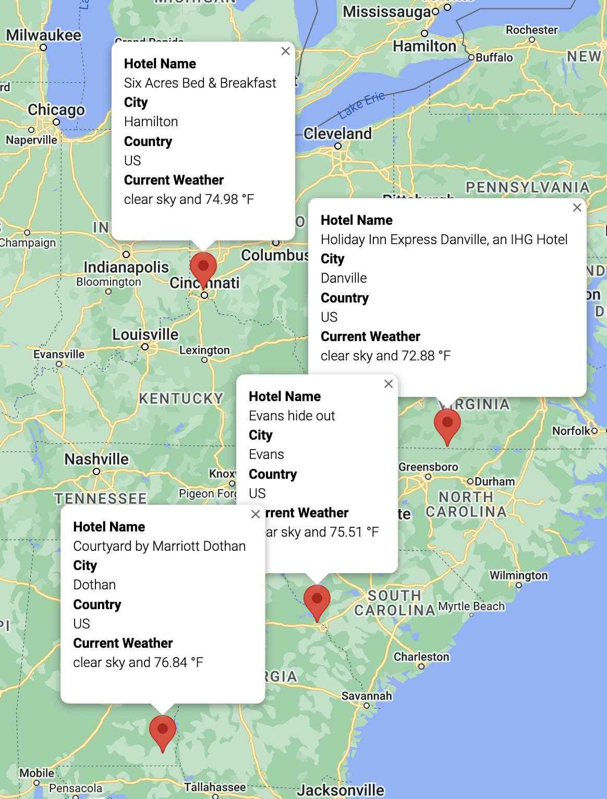
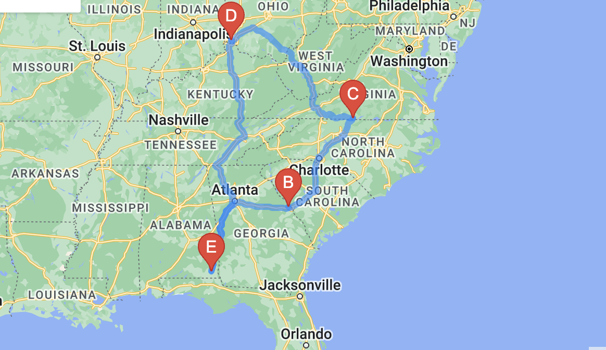

# World_Weather_Analysis

### Using world weather data with OpenWeatherMap API and pairing that with Google Maps API. First we started with random latitudes and longitudes and pulled weather data (temp, humidity, cloudiness, wind speed, description). Then we were able to locate cities and hotels next to the random Lats / Longs and overlay them on a Google Map for easily planing a mini vacation:

